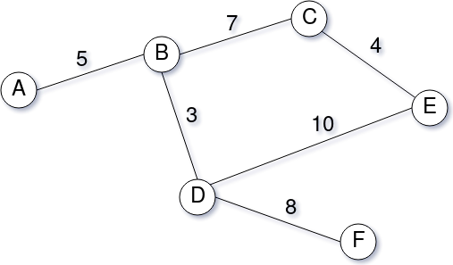

## Sobre
 Esse teste tem como objetivo utilizar algoritmos para realizar a busca de menor custo a partir de um grafo. Para poder analisar melhores candidatos a determinadas vagas.

 


## Instalando

----------------
Para iniciar o projeto basta utilizar os comandos abaixo: 

- ```docker-compose build```
- `docker-compose up`

----------------
## Testes

----------------
Por estar utilizando Docker, utilize o comando abaixo para rodar os testes automatizados: 

- ```docker-compose exec api npm test```

----------------


## Variáveis de ambiente 

----------------

- HOSTNAME - utilizada para configurar o hostname da aplicação
- PORT - utilizada para configurar a porta para a aplicação
- URI_MONGO - string de conexão para o banco de dados MongoDB

----------------


## GET ranking

```
GET http://localhost:9000/v1/vagas/5dded576982cea71278698b5/candidaturas/ranking
```


----------------

### Request

> 

### Examples:

> 
> **Example: GET ranking**
> 
> > 
> > ```
> > GET http://localhost:9000/v1/vagas/id_vaga/candidaturas/ranking
> > ```
> > 
> > **Request**
> > 
> > > 
> > 
> > ----------------
> > 
> > **Response**
> > 
> > > 
> > > **Body**
> > > 
> > > ```
> > > {
> > >   "data": [
> > >     {
> > >       "job_id": "5dded576982cea71278698b5", 
> > >       "person_score": 100, 
> > >       "created_at": "2019-11-27T19:59:15.552Z", 
> > >       "__v": 0, 
> > >       "person_id": "5dded578982cea47088698b6", 
> > >       "_id": "5dded593982ceae6e78698b7"
> > >     }, 
> > >     {
> > >       "job_id": "5dded576982cea71278698b5", 
> > >       "person_score": 100, 
> > >       "created_at": "2019-11-27T19:59:33.128Z", 
> > >       "__v": 0, 
> > >       "person_id": "5dded578982cea47088698b6", 
> > >       "_id": "5dded5a5982cea86048698b8"
> > >     }, 
> > >     {
> > >       "job_id": "5dded576982cea71278698b5", 
> > >       "person_score": 100, 
> > >       "created_at": "2019-11-27T19:59:34.541Z", 
> > >       "__v": 0, 
> > >       "person_id": "5dded578982cea47088698b6", 
> > >       "_id": "5dded5a6982cead7578698b9"
> > >     }
> > >   ]
> > > }
> > > ```
> > > 
> > 
> 

----------------

## POST candidatura

```
POST http://localhost:9000/v1/candidaturas
```


----------------

### Request

> 
> **Header**
> 
> |Key|Value|Description|
> |---|---|---|
> |Content-Type|application/json||
> 
> **Body**
> 
> ```
> {
>   "id_vaga": "5dded576982cea71278698b5",
>   "id_pessoa": "5dded578982cea47088698b6"
> }
> ```
> 

### Examples:

> 
> **Example: POST candidatura**
> 
> > 
> > ```
> > POST http://localhost:9000/v1/candidaturas
> > ```
> > 
> > **Request**
> > 
> > > 
> > > **Header**
> > > 
> > > |Key|Value|Description|
> > > |---|---|---|
> > > |Content-Type|application/json||
> > > 
> > > **Body**
> > > 
> > > ```
> > > {
> > >   "id_vaga": "5dded576982cea71278698b5",
> > >   "id_pessoa": "5dded578982cea47088698b6"
> > > }
> > > ```
> > > 
> > 
> > ----------------
> > 
> > **Response**
> > 
> > > 
> > > **Body**
> > > 
> > > ```
> > > {
> > >   "message": "Candidatura realizada com sucesso", 
> > >   "data": {
> > >     "job_id": "5dded576982cea71278698b5", 
> > >     "person_score": 100, 
> > >     "created_at": "2019-11-27T22:49:20.535Z", 
> > >     "__v": 0, 
> > >     "person_id": "5dded578982cea47088698b6", 
> > >     "_id": "5ddefd7074316e3ad73b3a82"
> > >   }
> > > }
> > > ```
> > > 
> > 
> 

----------------

## POST vagas

```
POST http://localhost:9000/v1/vagas
```


----------------

### Request

> 
> **Header**
> 
> |Key|Value|Description|
> |---|---|---|
> |Content-Type|application/json||
> 
> **Body**
> 
> ```
> {
>   "empresa": "Teste",
>   "titulo": "Vaga teste",
>   "descricao": "Criar os mais diferentes tipos de teste",
>   "localizacao": "A",
>   "nivel": 3
> }
> ```
> 

### Examples:

> 
> **Example: POST vagas**
> 
> > 
> > ```
> > POST http://localhost:9000/v1/vagas
> > ```
> > 
> > **Request**
> > 
> > > 
> > > **Header**
> > > 
> > > |Key|Value|Description|
> > > |---|---|---|
> > > |Content-Type|application/json||
> > > 
> > > **Body**
> > > 
> > > ```
> > > {
> > >   "empresa": "Teste",
> > >   "titulo": "Vaga teste",
> > >   "descricao": "Criar os mais diferentes tipos de teste",
> > >   "localizacao": "A",
> > >   "nivel": 3
> > > }
> > > ```
> > > 
> > 
> > ----------------
> > 
> > **Response**
> > 
> > > 
> > > **Body**
> > > 
> > > ```
> > > {
> > >   "message": "vaga adicionada com sucesso!", 
> > >   "data": {
> > >     "description": "Criar os mais diferentes tipos de teste", 
> > >     "level": "3", 
> > >     "created_at": "2019-11-27T22:49:40.367Z", 
> > >     "title": "Vaga teste", 
> > >     "__v": 0, 
> > >     "location": "A", 
> > >     "organization": "Teste", 
> > >     "_id": "5ddefd8474316e4b6e3b3a83"
> > >   }
> > > }
> > > ```
> > > 
> > 
> 

----------------

----------------
